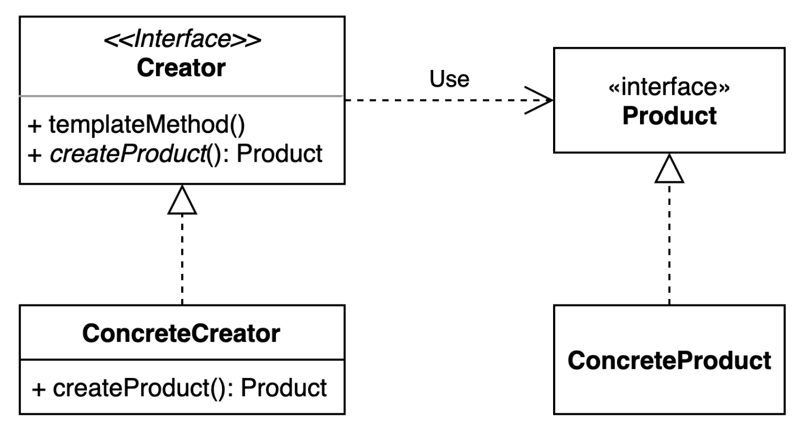

# Prefer Dependency Injection to Hardwiring Resources
자원을 직접 명시하지 말고 의존 객체 주입을 사용하라

## 요약
- 클래스가 하나 이상의 자원에 의존하고, 그 자원이 클래스 동작에 영향을 준다면, 자원을 클래스 외부에서 주입하라.
- 이 방식은 클래스의 유연성, 재사용성, 테스트 용이성을 높여준다.
- 자원을 사용하는 클래스가 자원을 직접 만들지 않고, 외부에서 주입받게 되면, 클래스는 자원을 사용하는 방법에만 집중할 수 있다.
- 자원을 사용하는 클래스가 자원을 직접 만들게 되면, 자원을 만드는 방법에 대한 결정을 클래스가 내리게 되어, 클래스의 유연성이 떨어진다. .

## 결론
- 자원을 사용하는 클래스가 자원을 직접 만들지 않고, 외부에서 주입받게 되면, 클래스는 자원을 사용하는 방법에만 집중할 수 있다.
- 자원을 사용하는 클래스가 자원을 직접 만들게 되면, 자원을 만드는 방법에 대한 결정을 클래스가 내리게 되어, 클래스의 유연성이 떨어진다.

## 참고
- [Effective Java 3/E, Item 5: Prefer Dependency Injection to Hardwiring Resources](https://www.amazon.com/Effective-Java-3rd-Joshua-Bloch/dp/0134685997)
- [Effective Java 3/E, Item 5: Prefer Dependency Injection to Hardwiring Resources (한글)](https://book.naver.com/bookdb/book_detail.nhn?bid=16313117)

## 예제 코드
```java
public class SpellChecker {
    private final Lexicon dictionary;

    public SpellChecker(Lexicon dictionary) {
        this.dictionary = Objects.requireNonNull(dictionary);
    }

    public boolean isValid(String word) {
        return dictionary.isValid(word);
    }

    public List<String> suggestions(String typo) {
        return dictionary.suggestions(typo);
    }
}
```

## 관련 패턴
### Factory Method Pattern
구체적으로 어떤 인스턴스를 만들지는 서브 클래스가 정하는 패턴
- 객체 생성을 서브 클래스로 분리하여 캡슐화하는 패턴
- OCP(Open-Closed Principle)를 지키도록 도와주는 패턴
- Spring IOC의 BeanFactory의 핵심적인 패턴

생성자의 자원 팩터리를 넘겨주는 방식으로 변형 할 수 있다.

#### 예제코드

```java

import java.util.Dictionary;
import java.util.function.Supplier;

public class SpellChecker {
    private final Dictionary dictionary;

    public SpellChecker(DictionayFactory dictionaryFactory) {
        this.dictionary = dictionaryFactory.get();
    }

    public SpellChecker(Supplier<? extends  Dictionary> dictionary) {
        this.dictionary = dictionary.get();
    }

    public boolean isValid(String word) {
        return dictionary.isValid(word);
    }

    public List<String> suggestions(String typo) {
        return dictionary.suggestions(typo);
    }
}
```
클라이언트 코드
```java
public class Main {
    public static void main(String[] args) {
        SpellChecker spellChecker = new SpellChecker(Dictionary::new);
        SpellChecker spellChecker = new SpellChecker(DictionayFactory::get);
    }
}
```
### Spring IOC
- Inversion of Control(뒤짚힌 제어권) 
- 자기 코드에 대한 제어권을 자신이 아닌 외부에서 제어하는 경우
- 재어권은 인스터스, 메소드 실행, 의존성 주입등을 이야기한다.

### 스프링 IoC 컨테이너 장점
- 자바 표준 스팩(@Inject)도 지원.
- 손쉽게 싱글톤 객체를 생성하고 관리.
- 객체 생성 (Bean) 관련 라이프 사이클 인터페이스 제공

### 스프링 IoC 컨테이너 예제
```java
import org.springframework.context.ApplicationContext;
import org.springframework.context.annotation.AnnotationConfigApplicationContext;

public class Main {
    public static void main(String[] args) {
        ApplicationContext context = new AnnotationConfigApplicationContext(AppConfig.class);
        SpellChecker spellChecker = context.getBean(SpellChecker.class);
    }
}
```

```java
import org.springframework.context.annotation.Bean;
import org.springframework.context.annotation.Configuration;

@Configuration
public class AppConfig {
    @Bean
    public SpellChecker spellChecker() {
        return new SpellChecker(new Dictionary());
    }
}
```
Config를 사용하지 않고 @Component를 사용하여 Bean을 등록할 수 있다.

```java
import org.springframework.stereotype.Component;
 
@Component
public class SpellChecker {
    private final Dictionary dictionary;
 
    public SpellChecker(Dictionary dictionary) {
        this.dictionary = dictionary;
    }
}
```
그것을 @ComponentScan을 사용하여 Bean을 등록할 수 있다.

```java
import org.springframework.context.annotation.ComponentScan;
import org.springframework.context.annotation.Configuration;

@Configuration
@ComponentScan(basePackages = "com.kibong.effective_java_study.creating_destroying_objects.prefer_dependency_injection")
public class AppConfig {
}
```


